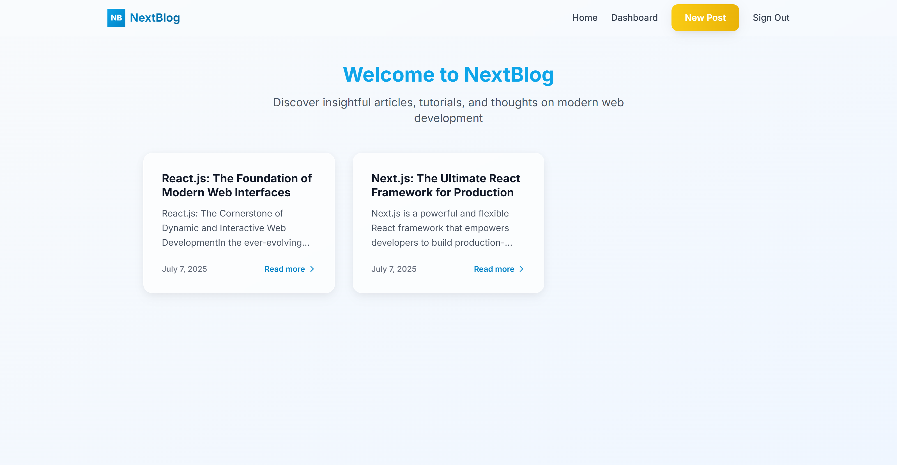
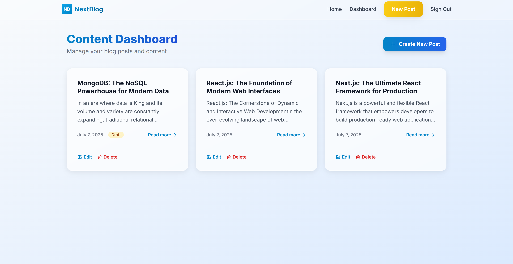
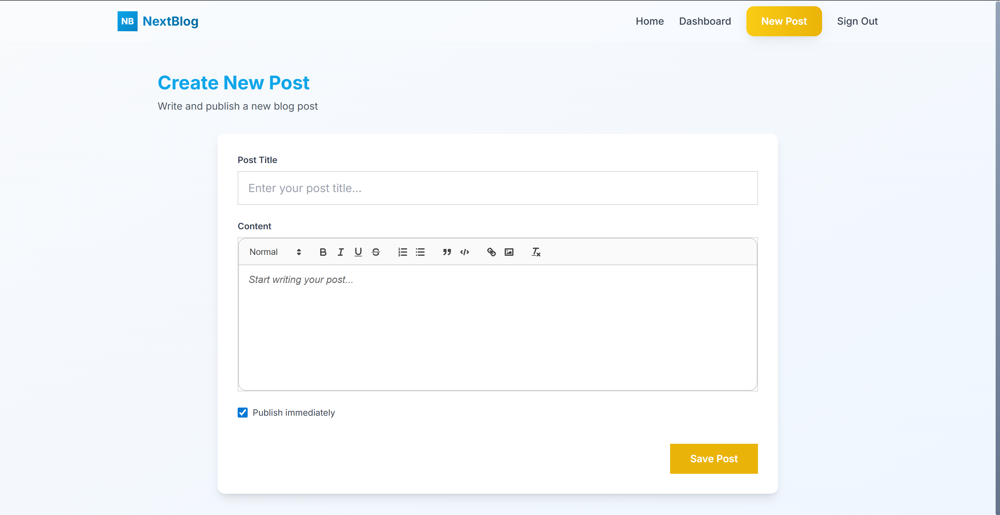
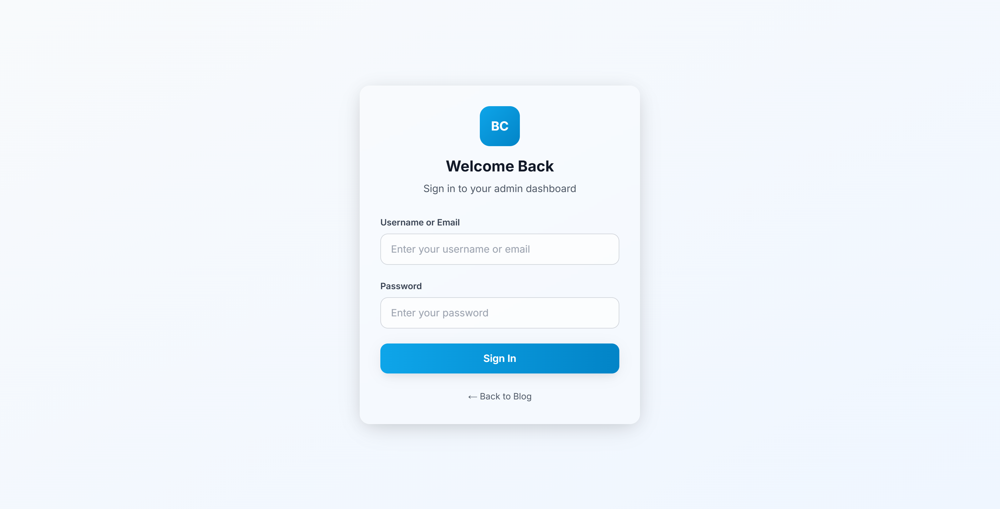

# 🚀 NextBlog — Modern Blog Platform

<p align="center">
  
  
  
  
  
</p>

<p align="center">
  <b>A clean, modern, and responsive blogging platform.<br>
  Built with Next.js 14, MongoDB Atlas, Tailwind CSS, and React-Quill.</b>
</p>

---

## 🏠 Home Page

<p align="center">
  
</p>

---

## 🛡️ Admin Dashboard

<p align="center">
  
</p>

---

## 📝 Create Post

<p align="center">
  
</p>

---

## 🔑 Admin Login

<p align="center">
  
</p>

---

## 🔐 Quick Admin Access

> **Test Admin Account:**  
> **Email:** `admin@mail.com`  
> **Password:** `admin@123`

---

## ✨ Features

- **🖼️ Beautiful UI:** Glassmorphism, smooth animations, mobile-first
- **🔐 Secure Admin Auth:** NextAuth.js + bcrypt, JWT sessions
- **✍️ Rich Content:** WYSIWYG editor, SEO-friendly slugs
- **🗂️ Full CRUD:** Publish, update, delete posts (admin)
- **⚡ SEO & Performance:** SSR, image optimization, dynamic meta tags
- **👨‍💻 Dev Experience:** TypeScript, clean architecture, error handling

---

## 🚀 Quick Start

<details>
<summary><b>Show Setup Instructions</b></summary>

### Prerequisites

- **Node.js** v18+
- **MongoDB Atlas** (free-tier)
- **Git**

### 1. Clone & Install

```bash
git clone https://github.com/thefznkhan/nextblog.git
cd nextblog
npm install
```

### 2. Configure Environment

Create `.env.local`:

```env
MONGODB_URI=your-mongodb-connection-string
NEXTAUTH_URL=http://localhost:3000
NEXTAUTH_SECRET=your-32-byte-secret
NEXT_PUBLIC_BASE_URL=http://localhost:3000
```

### 3. Start Development

```bash
npm run dev
```

Visit [http://localhost:3000](http://localhost:3000)

</details>

---

## 🧩 Tech Stack

| Tool             | Purpose                    |
| ---------------- | -------------------------- |
| **Next.js 14**   | Full-stack React framework |
| **React 18**     | Frontend library           |
| **MongoDB**      | Cloud database             |
| **Mongoose**     | MongoDB ODM                |
| **NextAuth.js**  | Authentication             |
| **React-Quill**  | Rich text editing          |
| **Tailwind CSS** | Styling                    |
| **bcryptjs**     | Password hashing           |

---

## 📚 API Overview

<details>
<summary><b>Show API Endpoints</b></summary>

### Posts

- `GET /api/posts` — List all posts
- `POST /api/posts` — Create post (admin)
- `GET /api/posts/[slug]` — Get single post
- `PUT /api/posts/[slug]` — Update post (admin)
- `DELETE /api/posts/[slug]` — Delete post (admin)

### Admin

- `GET /api/admin/setup` — Check if admin exists
- `POST /api/admin/setup` — Create initial admin

</details>

---

## 🛠️ Configuration Tips

- **MongoDB:** Whitelist your IP in Atlas
- **NEXTAUTH_SECRET:** Must be consistent for sessions
- **Tailwind:** Customize in `tailwind.config.js`

---

## 🆘 Troubleshooting

- **MongoDB connection error:** Check `.env.local`, whitelist IP
- **NextAuth JWT errors:** Ensure `NEXTAUTH_SECRET` is set, clear cookies
- **Tailwind issues:** Run `rm -rf .next` and restart

---

## 🤝 Contribution Guide

1. **Fork** the repo
2. **Branch:** `git checkout -b feat/your-feature`
3. **Develop & Test**
4. **Lint/Test:** `npm run lint && npm test`
5. **Pull Request**

---

## 📝 License & Credits

This project is **MIT licensed** — see [LICENSE](LICENSE).  
Thanks to the Next.js, MongoDB, Tailwind CSS, and React-Quill communities!

---

<p align="center">
  Made with ❤️ by <a href="https://github.com/thefznkhan">THEFZNKHAN</a>.<br>
  If you enjoy this project, please <b>⭐ star</b> on GitHub!
</p>
